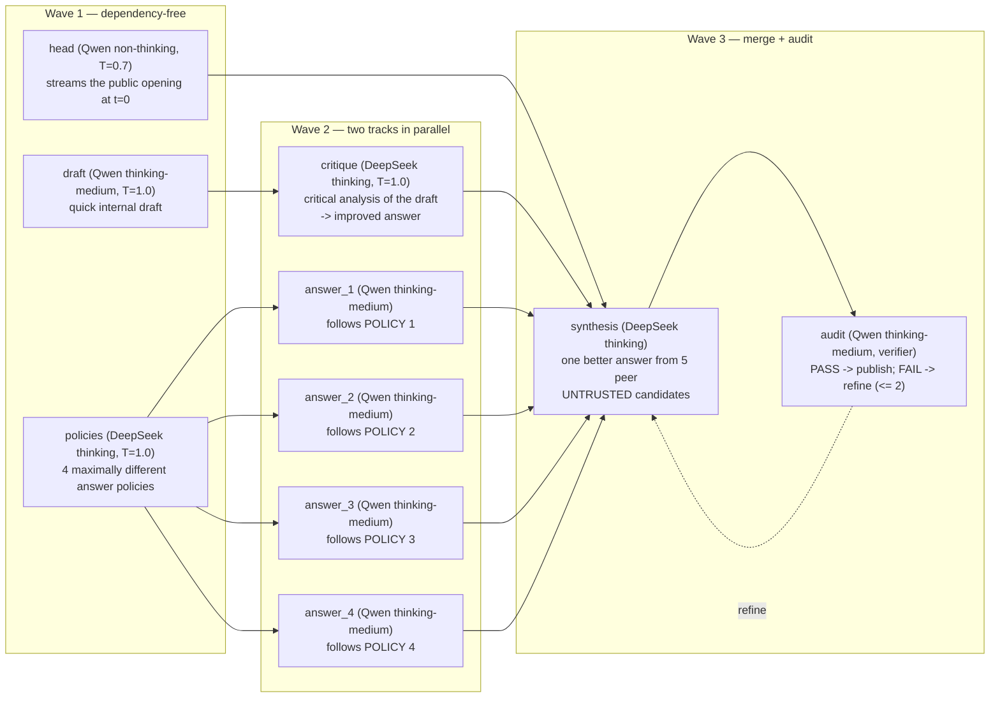

# Qwen3.8 × 2 + DeepSeek-V4.1 (six GPUs) judged ensemble on 8 × RTX PRO 6000

This example serves the ensemble product of
[`qwen3.8-deepseek-v4-8gpu`](../qwen3.8-deepseek-v4-8gpu/README.md) with a
different L1:

- DeepSeek-V4.1-Flash replaces DeepSeek-V4-Flash-0731 and runs on six GPUs.
- Qwen3.8-27B runs on the other two GPUs.

V4.1 accepts images, so every role sees attached images directly and there
is no Qwen image-description stage. Design: DTO-D16 in
[`example-dual-track-orchestration.md`](../../docs/design/example-dual-track-orchestration.md).

```text
Open WebUI (:3009)
    -> Kairyu L3 product API (:8009; model kairyu-auto-max)
        -> Kairyu L2 route judge (one Qwen non-thinking call, DTO-D13):
             QWEN / QWEN_THINK / DEEPSEEK / DEEPSEEK_THINK / ENSEMBLE
        -> primary profile: the dual-track ensemble DAG
           (10 roles: 9 generation + 1 audit verifier)
             Track A: DeepSeek writes 4 maximally different answer policies;
                      4 Qwen answerers follow them in parallel on 2 replicas
             Track B: a Qwen quick draft, critically refined by thinking DeepSeek
             Merge:   thinking DeepSeek synthesizes one better answer from the
                      5 peer candidates; a Qwen audit verifies it (PASS/FAIL,
                      <= 2 refinement rounds) before the remainder streams
             Images:  every role receives the request's images itself
        -> L1 pools: DeepSeek-V4.1-Flash DP6/EP6 (GPU 0-5),
                     2 x Qwen3.8-27B-FP8 TP1 (GPU 6, 7)
Embedding clients -> Kairyu L3 embeddings API (:8009; model embed-small)
```

## Routing: one Qwen judge picks exactly one of five routes (DTO-D13)

Every request first goes to a small, fast Qwen call, the *route judge*. It
answers with one of five labels. Only the route with that label runs for the
request; the other four do not execute at all.

1. **Judge.** One non-thinking Qwen3.8 call reads the latest user turn and
   answers exactly one label:
   - greedy decoding, at most 8 output tokens, 5 s timeout;
   - it sees a 4,000-character head+tail view of the turn;
   - it also sees a one-line context flag: `tool calling yes/no; image
     attached yes/no`.
2. **Dispatch.** Kairyu attaches the verdict once, before preflight and
   admission, and builds only that route's DAG. Four routes are a single
   model call; the fifth is the ensemble below.
3. **Fallback.** If the judge times out, errors, or answers anything other
   than exactly one offered label, the request runs the ensemble. The
   ensemble is the quality-safe route.

| label | route (profile) | what runs | thinking | sampling (fixed, DTO-D8) | max_tokens cap |
|---|---|---|---|---|---|
| `QWEN` | `qwen_direct` | one Qwen3.8 call (`qwen_answer`) | no | T=0.7, top_p=0.8, top_k=20, presence_penalty=1.5 | 131,072 |
| `QWEN_THINK` | `qwen_think_medium` | one Qwen3.8 call (`qwen_think_answer`) | fixed medium (spec `high`) | T=1.0, top_p=0.95, top_k=20 | 131,072 |
| `DEEPSEEK` | `deepseek_direct` | one DeepSeek-V4.1 call (`deepseek_answer`) | no (`enable_thinking: false`) | T=1.0, top_p=0.95 | 262,144 |
| `DEEPSEEK_THINK` | `deepseek_think` | one DeepSeek-V4.1 call (`deepseek_think_answer`) | caller's L3 effort (default high) | T=1.0, top_p=0.95 | 262,144 |
| `ENSEMBLE` | `primary` | the ten-role dual-track DAG below | per role | per role | per role |

The judge is asked to pick the fastest and cheapest route that will still
answer correctly and completely, escalating only when the request needs it.
It sees the routes from fastest to most thorough, each with a short
description of the requests it suits:

- `QWEN`: a small fast model answers at once. Chit-chat, short facts,
  rewording, translation or formatting, simple lookups, trivial one-liners,
  and exact fixed outputs.
- `QWEN_THINK`: moderate reasoning. Short math or logic, small
  well-specified coding tasks, step-by-step explanations, and routine agent
  tool-call turns.
- `DEEPSEEK`: frontier knowledge, breadth, or long-context comprehension
  without deep deliberation.
- `DEEPSEEK_THINK`: hard problems where careful deliberation decides
  correctness. Competition math, complex algorithms, multi-file coding or
  debugging, proofs, and planning.
- `ENSEMBLE`: the hardest, highest-stakes open-ended work, where comparing
  several independent approaches and auditing the merged answer materially
  improves quality. By far the slowest and most expensive route.

This is a prompt-driven heuristic, not a measured cost model. The criteria
live in `auto-max.yaml` (`profile_judge.choices[*].criteria`). Every trace
records the verdict, the offered labels, and the judge's token usage, and
`/routing` reports the configuration.

### Contract details

- **Images.** Both pools accept images, so an image request is offered all
  five routes. The ensemble's roles each receive the image itself (see
  below). The ensemble's limit is the Qwen pool's policy: one inline image of
  up to 8 MiB and 2,097,152 pixels.
- **Agent turns.** Tool-calling, `response_format`, and plain-text
  structured-format turns are judged like every other turn.
  - A direct route has no head. Its single publisher writes the complete
    answer in the demanded format and emits the actual tool call when the
    conversation requires one.
  - In the ensemble, the head is disabled for such turns. `synthesis` then
    renders its `prompt_headless` body and writes the whole answer; it uses a
    trailing tool result directly when there is one.
  - Internal roles state an intended tool call in one sentence instead of
    emitting tool-call syntax.
  - `n>1` requests skip the audit.
- **Sampling on the direct routes is fixed** on the final unit.
  - Overridden: the caller's `temperature` and `top_p`.
  - Still applied: the caller's `n`, `logprobs`, `response_format`, tools,
    and public `max_tokens`.
  - The route cap is min()'d with the caller's allowance. From the Chat UI
    (default 65536) the caller's cap binds first.
- **Thinking is selected per request, on one DeepSeek pool** (DTO-D16).
  - A DeepSeek role with an effort sends `reasoning_effort`. The official
    V4.1 encoder renders it as the thinking budget: low 50, high 75, max 100.
  - A role without an effort is sent `enable_thinking: false` and runs in
    chat mode. Kairyu does this for every effort-less role on a pool that
    accepts `enable_thinking`, which also covers the Qwen judge and head.
- **Public-output floor** (DTO-D9/D15).
  - The thinking final units reserve 256 public tokens: `synthesis`,
    `deepseek_think_answer`, and `qwen_think_answer`.
  - When thinking consumes the caller's whole cap, one bounded re-dispatch
    continues the captured reasoning as a closed assistant turn and answers
    with the reserve.
  - For DeepSeek this relies on overlay edit 7 (see below).

## The ensemble route: the dual-track DAG (DTO-D1)

The `primary` route is a ten-role ensemble that runs in three waves: nine
generation roles and one audit verifier. It runs only when the judge answers
`ENSEMBLE`, or as the fallback, and inside it no role is skipped.



- **Track A (diversity).** One thinking DeepSeek call writes four policies
  that are as different from one another as possible. Four Qwen answerers
  then each answer the request following one policy.
- **Track B (draft refinement).** A quick Qwen draft is written alongside
  the policy call. Thinking DeepSeek then critically analyses it and writes
  an improved complete answer.
- **Merge.** Thinking DeepSeek `synthesis` treats the five candidates as
  peers: the critique's answer plus the four policy answers, all marked
  UNTRUSTED. It verifies their claims, compares them, and writes one answer
  better than every candidate.
- **Audit.** A Qwen audit judges the committed opening plus the candidate
  remainder as one public answer. The remainder is published only after
  `PASS`, or after two refinement rounds.

| role | worker | effort / budget | what it does |
|---|---|---|---|
| `head` | Qwen | none (non-thinking), 256 tokens | Streams the committed public opening from t=0; the TTFT gate is on it. |
| `draft` | Qwen | fixed medium, 2048 | Writes a quick, complete internal draft. Track B's input; never published. |
| `policies` | DeepSeek | inherit; 8192 / 32768 / 65536 by effort | One call emitting `POLICY 1:`..`POLICY 4:`, each a substantively different angle, method, structure, and trade-off. |
| `answer_1..4` | Qwen (two per replica) | fixed medium, 4096 each | Four policy-bound answers in parallel. The policy steers how to answer; the request alone defines what to answer. |
| `critique` | DeepSeek | inherit; 8192 / 32768 / 65536 | Finds the draft's flaws, gaps, and format deviations, then writes one improved complete answer. |
| `synthesis` | DeepSeek | inherit; caller's public cap, floor 256 | The final unit. Merges the five peer candidates into one better answer, continuing after the opening, or outputs `NO_CONTINUATION` when the opening already answers the request. |
| `audit` | Qwen | fixed medium, 16384 | Verifier on `synthesis`. Checks correctness, completeness, consistency, and reply format; the first line is `PASS` or `FAIL`. FAIL bullets drive up to 2 refinements, then the last attempt is published. |

Design notes (details:
[`example-dual-track-orchestration.md`](../../docs/design/example-dual-track-orchestration.md)):

- **Images reach every role** (DTO-D16). Kairyu attaches the request's
  images to each role call (`derive_multimodal_prompt`): the role's text is
  one user message and the images follow it. This covers the DeepSeek
  `policies`, `critique`, and `synthesis` roles, which is why the V4
  example's Qwen `image_description` stage and its `IMAGE DESCRIPTION`
  prompt blocks are gone.
- **Policy binding** (DTO-D2). The L2 DSL cannot split one output. Each
  answerer therefore receives the whole policy list, and is bound to its own
  policy by prompt and by a distinct `seed_offset`. The REQUEST and POLICY
  LIST blocks are byte-identical across the four answerers.
- **Every ensemble DeepSeek role thinks** (DTO-D7). They declare
  `reasoning_effort: inherit`: the caller's L3 effort, or high when the
  caller sent none.
  - The effort sets V4.1's official thinking budget (50/75/100).
  - It also grades the token caps (DTO-D8, halved by DTO-D12). Those caps
    are clamped by `internal_max_tokens` (65536) and the caller's public
    `max_tokens`, so the serial DeepSeek chain fits Terminal-Bench's 900 s
    per-turn envelope.
- **Qwen effort is fixed per role** (DTO-D14). It never comes from the
  caller.
  - `draft`, `answer_1..4`, and `audit` declare `reasoning_effort: high`.
    The example-local `qwen3.8-chat.jinja` turns that into medium thinking,
    renders the medium preamble, and clamps `max` to `high`.
  - `head` declares no effort, so it stays non-thinking and its opening
    streams immediately.
- **Scheduling.** The level-synchronous scheduler runs three waves.
  - Wave 1: head, draft, policies.
  - Wave 2: answer_1..4 and critique.
  - Wave 3: synthesis, audited inline.
  - Per request, DeepSeek sees at most one call in flight per wave.
  - `queue_depth_threshold: 0` spreads the concurrent Qwen roles over the
    two replicas.
  - Budget `{max_steps: 18, max_refine_depth: 2}`: 9 generation units, 1
    empty-output re-dispatch, 3 audit verdicts, 3 inconclusive re-verifies,
    and 2 refinements.
- **Visible internal work.** Completed L2/L1 stages are sent as
  model-attributed `reasoning_content`. Open WebUI shows them in an
  expandable internal-work item, and only the final answer is `content`.

Kairyu exposes one public chat model, `kairyu-auto-max`, and one embedding
model, `embed-small`. L2 borrows the deployment-owned L1 pools through
`engine_ref` and never calls the public L3 endpoint recursively.

## What is inherited and what changed

Inherited unchanged from the V4 example:

- the judge, its five routes, and its criteria;
- the DAG's roles, prompt bodies, seeds, and sampling;
- the DeepSeek effort budgets (8192/32768/65536) and the 65536 ceiling;
- the public-output floor (256);
- the audit loop and the `{…, 2}` refinement bound;
- the head stream and its TTFT gate;
- embeddings, the one public chat model, and the Chat UI effort dropdown.

| | V4 example | This example |
|---|---|---|
| GPUs | Qwen 0–3, DeepSeek 4–7 | DeepSeek 0–5, Qwen 6–7 |
| DeepSeek L1 | V4-0731 TP4/EP4 | V4.1 DP6/EP6: the measured L1 of [`deepseek-v4.1-flash-6gpu`](../deepseek-v4.1-flash-6gpu/README.md) |
| Qwen replicas | 4 (one answerer each) | 2 (two answerers each) |
| Images | Qwen `image_description` feeds text-only DeepSeek roles | every role gets the image; every route is offered on image requests |
| DeepSeek prompting | inline completion scaffold, passthrough template | chat requests rendered by the official V4.1 encoder |
| DeepSeek pools | thinking pool + non-thinking pool | one pool: `reasoning_effort` → thinking (50/75/100), none → `enable_thinking: false` |
| Budget | `{19, 2}` | `{18, 2}` (one generation unit fewer) |
| Direct DeepSeek cap | 393216 | 262144 (V4.1 model card: max_tokens ≥ 256K) |
| Sandbox executor | deployed, unreferenced | not deployed |

The ensemble accepts one image per request, because that is the Qwen
pool's image policy. A request with more images is rejected by the
ensemble's Qwen roles. DeepSeek alone accepts up to eight.

## DeepSeek L1 and its overlay

The DeepSeek service copies the committed six-GPU command and differs in two
ways:

- **No `--default-chat-template-kwargs`.** The V4.1 encoder ORs `thinking`
  and `enable_thinking`, so a server-wide `thinking: true` would make the
  non-thinking route think. With neither key set, the encoder defaults to
  thinking at high (75).
- **A loopback port (8010).** It serves the launcher's probes, the
  benchmark tokenizer, and the paired direct TTFT row.

`vllm-sm120.Dockerfile` + `patch_sm120.py` build this example's own overlay
on the pinned vLLM nightly. It carries the six SM120 edits of the six-GPU
example and adds **edit 7**.

The V4.1 encoder ignores `continue_final_message`. Kairyu's public-output
floor (DTO-D9/D15) continues a thinking span that used up its cap by sending
`<think>\n…\n</think>\n\n` as the final assistant turn. Edit 7 renders that
turn as an open continuation:

- the span becomes the turn's reasoning;
- the end-of-sentence token is omitted.

Other renderings are byte-identical. `check_sm120_kernels.py` is the
numerical kernel gate; run it inside the built image as the six-GPU README
describes.

## Start

```sh
export KAIRYU_RESPONSES_COMPACTION_SECRET="$(openssl rand -hex 32)"
# Optional: hard-link already downloaded checkpoints instead of re-fetching.
export DEEPSEEK_MODEL_SEED=/mnt/nvme/kairyu/model-volumes/deepseek-v4.1-flash-6gpu/models/deepseek-v4.1-flash
export QWEN_MODEL_SEED=/mnt/nvme/kairyu/model-volumes/qwen3.8-27b-1gpu/models/qwen3.8-27b-fp8
./examples/qwen3.8-deepseek-v4.1-8gpu/run.sh
```

`up` performs the following steps:

- Refuses to evict other workloads: every GPU must be idle, and the host
  needs 256 GiB available for the Engram tables.
- Pins DeepSeek to the NUMA nodes of GPUs 0–5 and each Qwen replica to its
  GPU's node.
- Builds the overlay and refuses any image ID other than the pinned one.
- Attests both checkpoints by tree SHA-256; a seeded copy is re-hashed.
- Waits for the stack.
- Probes the DeepSeek L1 directly:
  - rendered efforts, chat mode, and the edit-7 continuation;
  - exact finite `323` answers from every DP rank in default, low, and chat
    mode;
  - one image.
- Validates the served L2 policy against `example.json`.
- Installs the Chat UI effort dropdown.

`run.sh down|status|logs` manage the stack.

## Verification

```sh
./examples/qwen3.8-deepseek-v4.1-8gpu/verify.sh list
./examples/qwen3.8-deepseek-v4.1-8gpu/verify.sh serving-auto-max --no-start
./examples/qwen3.8-deepseek-v4.1-8gpu/verify.sh serving-auto-max-coding --no-start
./examples/qwen3.8-deepseek-v4.1-8gpu/verify.sh vision --no-start
./examples/qwen3.8-deepseek-v4.1-8gpu/verify.sh tool-calling --no-start
./examples/qwen3.8-deepseek-v4.1-8gpu/browser-smoke.sh
```

- **`serving-auto-max` and `serving-auto-max-coding`** are the V4 example's
  route-aware matrices. The coding matrix's TTFT gate is ≤ 2 × the paired
  direct V4.1 row. No pinned fallback denominator exists yet, so a failed
  paired row fails the gate.
- **`vision`** sends one-image requests through the judge. Every answer must
  name the image colour, and at least one request must take the ensemble.
  The DeepSeek L1's `vllm:mm_cache_queries_total` must grow by at least one
  image per DeepSeek generation stage, which proves those stages received
  the image itself.
- **`tool-calling`** requires one executable bash tool call through L3.

Results and every measured deviation go to [`MEASUREMENTS.md`](MEASUREMENTS.md).
