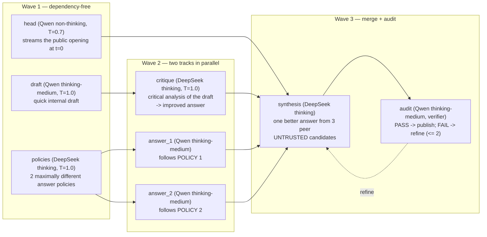

# Qwen3.8 × 2 + DeepSeek-V4.1 (six GPUs) judged ensemble on 8 × RTX PRO 6000

This example serves a two-route version of the ensemble product of
[`qwen3.8-deepseek-v4-8gpu`](../qwen3.8-deepseek-v4-8gpu/README.md).

- **L1.** DeepSeek-V4.1-Flash runs on six GPUs and Qwen3.8-27B runs on the
  other two.
- **Routes.** A Qwen judge picks one of two routes: one thinking DeepSeek
  answer, or a dual-track ensemble with two policies.
- **Images.** V4.1 accepts images, so every role sees attached images
  directly and there is no Qwen image-description stage.

Design: DTO-D16 and DTO-D17 in
[`example-dual-track-orchestration.md`](../../docs/design/example-dual-track-orchestration.md).

```text
Open WebUI (:3009)
    -> Kairyu L3 product API (:8009; model kairyu-auto-max)
        -> Kairyu L2 route judge (one Qwen non-thinking call, DTO-D13/D17):
             DEEPSEEK_THINK  or  ENSEMBLE
        -> deepseek_think: one thinking DeepSeek-V4.1 answer at the L3 effort
        -> primary: the dual-track ensemble DAG
           (8 roles: 7 generation + 1 audit verifier)
             Track A: DeepSeek writes 2 maximally different answer policies;
                      2 Qwen answerers follow them in parallel, one per replica
             Track B: a Qwen quick draft, critically refined by thinking DeepSeek
             Merge:   thinking DeepSeek synthesizes one better answer from the
                      3 peer candidates; a Qwen audit verifies it (PASS/FAIL,
                      <= 2 refinement rounds) before the remainder streams
             Images:  every role receives the request's images itself
        -> L1 pools: DeepSeek-V4.1-Flash DP6/EP6 (GPU 0-5),
                     2 x Qwen3.8-27B-FP8 TP1 (GPU 6, 7)
Embedding clients -> Kairyu L3 embeddings API (:8009; model embed-small)
```

## Routing: one Qwen judge picks one of two routes (DTO-D13, DTO-D17)

Every request first goes to a small, fast Qwen call, the *route judge*. It
answers with one of two labels. Only the route with that label runs for the
request; the other route does not execute at all.

1. **Judge.** One non-thinking Qwen3.8 call answers exactly one label:
   - greedy decoding, at most 8 output tokens, and a 5 s timeout;
   - it reads a 4,000-character head+tail view of the latest user turn;
   - it also sees a one-line context flag: `tool calling yes/no; image
     attached yes/no`.
2. **Dispatch.** Kairyu attaches the verdict once, before preflight and
   admission, and builds only that route's DAG.
3. **Fallback.** A judge timeout, an error, or any answer that is not exactly
   one offered label sends the request to `deepseek_think` (DTO-D17 second
   amendment). A slow or failed judge never escalates a request to the
   heavier ensemble.

| label | route (profile) | what runs | thinking | sampling (fixed, DTO-D8) | max_tokens cap |
|---|---|---|---|---|---|
| `DEEPSEEK_THINK` | `deepseek_think` | one DeepSeek-V4.1 call (`deepseek_think_answer`) | caller's L3 effort (default high) | T=1.0, top_p=0.95 | 262,144 |
| `ENSEMBLE` | `primary` | the eight-role dual-track DAG below | per role | per role | per role |

The judge is asked to pick the faster route that will still answer correctly
and completely, and to escalate only when the request needs it. The criteria
it reads (`profile_judge.choices[*].criteria` in `auto-max.yaml`):

- **`DEEPSEEK_THINK`:** everyday to moderate requests that one careful
  expert answer handles. That covers:
  - greetings and chit-chat, short questions, and facts;
  - rewording, translation, or formatting;
  - simple explanations and small, well-specified code edits;
  - routine agent tool-call turns whose next action is clear.
- **`ENSEMBLE`:** requests whose correctness depends on deep reasoning or on
  comparing several approaches. That covers:
  - math or logic problems;
  - algorithm design;
  - multi-file coding or debugging;
  - proofs, design, or planning;
  - multi-step analysis;
  - ambiguous or multi-constraint requests;
  - any request for a thorough answer.

  When the judge is unsure between the two routes, it is told to choose
  `ENSEMBLE`.

This is a prompt-driven heuristic, not a measured cost model. Every trace
records the verdict, the offered labels, and the judge's token usage, and
`/routing` reports the configuration.

### Contract details

- **Images.** Both pools accept images, so an image request is offered both
  routes. The ensemble's roles each receive the image itself (see below).
  - The ensemble's limit is the Qwen pool's policy: one inline image of up
    to 8 MiB and 2,097,152 pixels.
- **Agent turns.** Tool-calling, `response_format`, and plain-text
  structured-format turns are judged like every other turn.
  - `deepseek_think` has no head. Its single publisher writes the complete
    answer in the demanded format and emits the actual tool call when one is
    required.
  - In the ensemble, the head is disabled for such turns. `synthesis`
    renders its `prompt_headless` body and writes the whole answer.
  - Internal roles state an intended tool call in one sentence instead of
    emitting tool-call syntax.
  - `n>1` requests skip the audit.
- **`deepseek_think` sampling is fixed** on the final unit.
  - Overridden: the caller's `temperature` and `top_p`.
  - Still applied: the caller's `n`, `logprobs`, `response_format`, tools,
    and public `max_tokens`.
  - The 262,144 cap is min()'d with the caller's allowance. From the Chat
    UI (default 65536) the caller's cap binds first.
- **Every DeepSeek call thinks** (DTO-D16). It sends `reasoning_effort`,
  which the official V4.1 encoder renders as the thinking budget: low 50,
  high 75, max 100.
  - The Qwen judge and head declare no effort, so they are sent
    `enable_thinking: false`.
- **Public-output floor** (DTO-D9/D15). The thinking final units
  (`synthesis` and `deepseek_think_answer`) reserve 256 public tokens.
  - When thinking consumes the caller's whole cap, one bounded re-dispatch
    continues the captured reasoning as a closed assistant turn and answers
    with the reserve.
  - This relies on overlay edit 7 (see below).

## The ensemble route: the dual-track DAG (DTO-D1, DTO-D17)

The `primary` route is an eight-role ensemble in three waves: seven
generation roles plus one audit verifier. It runs only when the judge answers
`ENSEMBLE`. Inside it, no role is skipped.



- **Track A (diversity).** One thinking DeepSeek call writes two policies
  that are as different from each other as possible. Two Qwen answerers then
  answer the request in parallel, one per Qwen replica, each following one
  policy.
- **Track B (draft refinement).** A quick Qwen draft is written alongside
  the policy call. Thinking DeepSeek then critically analyses it and writes
  an improved complete answer.
- **Merge.** Thinking DeepSeek `synthesis` treats three UNTRUSTED
  candidates as peers: `answer_1`, `answer_2`, and the critique's answer. It
  verifies their claims, compares them, and writes one answer better than
  every candidate.
- **Audit.** A Qwen audit judges the committed opening plus the candidate
  remainder as one public answer. The remainder is published only after
  `PASS`, or after two refinement rounds.

| role | worker | effort / budget | what it does |
|---|---|---|---|
| `head` | Qwen | none (non-thinking), 256 tokens | Streams the committed public opening from t=0. The TTFT gate applies to it. |
| `draft` | Qwen | fixed medium, 2048 | A quick, complete internal draft. Track B's input; never published. |
| `policies` | DeepSeek | inherit; 8192 / 32768 / 65536 by effort | One call that emits `POLICY 1:` and `POLICY 2:`. Each is a substantively different angle, method, structure, and trade-off. |
| `answer_1`, `answer_2` | Qwen (one per replica) | fixed medium, 4096 each | Two policy-bound answers written in parallel. The policy steers how to answer; the request alone defines what to answer. |
| `critique` | DeepSeek | inherit; 8192 / 32768 / 65536 | Finds the draft's flaws, gaps, and format deviations, then writes one improved complete answer. |
| `synthesis` | DeepSeek | inherit; caller's public cap, floor 256 | The final unit. Merges candidates 1 = `answer_1`, 2 = `answer_2`, 3 = critique into one better answer that continues after the opening. Outputs `NO_CONTINUATION` if the opening already answers the request. |
| `audit` | Qwen | fixed medium, 16384 | Verifier on `synthesis`. Checks correctness, completeness, consistency, and reply format. The first line is `PASS` or `FAIL`; FAIL bullets drive up to 2 refinements, after which the last attempt is published. |

Design notes (details:
[`example-dual-track-orchestration.md`](../../docs/design/example-dual-track-orchestration.md)):

- **Images reach every role** (DTO-D16). Kairyu attaches the request's
  images to each role call (`derive_multimodal_prompt`): the role's text
  becomes one user message, followed by the images.
  - This includes the DeepSeek `policies`, `critique`, and `synthesis`
    roles.
  - That is why the V4 example's Qwen `image_description` stage and its
    `IMAGE DESCRIPTION` prompt blocks are gone.
- **Policy binding** (DTO-D2). The L2 DSL cannot split one output, so each
  answerer receives the whole policy list.
  - Each answerer is bound to its own policy by prompt and by a distinct
    `seed_offset`.
  - The REQUEST and POLICY LIST blocks are byte-identical across the two
    answerers.
- **Every ensemble DeepSeek role thinks** (DTO-D7). They declare
  `reasoning_effort: inherit`: the caller's L3 effort, or high when the
  caller sent none.
  - The effort sets V4.1's official thinking budget (50/75/100).
  - It also grades the token caps (DTO-D8, halved by DTO-D12).
  - Those caps are clamped by `internal_max_tokens` (65536) and by the
    caller's public `max_tokens`, so the serial DeepSeek chain fits
    Terminal-Bench's 900 s per-turn envelope.
- **Qwen effort is fixed per role** (DTO-D14) and never comes from the
  caller.
  - `draft`, `answer_1`, `answer_2`, and `audit` declare
    `reasoning_effort: high`. The example-local `qwen3.8-chat.jinja` turns
    that into medium thinking, renders the medium preamble, and clamps
    `max` to `high`.
  - `head` declares no effort, so it stays non-thinking and its opening
    streams immediately.
- **Scheduling.** The level-synchronous scheduler runs three waves.
  - Wave 1: head, draft, and policies.
  - Wave 2: answer_1, answer_2, and critique.
  - Wave 3: synthesis, audited inline.
  - Per request, DeepSeek sees at most one call in flight per wave.
  - `queue_depth_threshold: 0` puts the two answerers on different Qwen
    replicas.
  - The budget is `{max_steps: 16, max_refine_depth: 2}`: 7 generation
    units, 1 empty-output re-dispatch, 3 audit verdicts, 3 inconclusive
    re-verifies, and 2 refinements.
- **Visible internal work.** Completed L2/L1 stages are sent as
  model-attributed `reasoning_content`. Open WebUI shows them in an
  expandable internal-work item; only the final answer is sent as
  `content`.

Kairyu exposes one public chat model, `kairyu-auto-max`, and one embedding
model, `embed-small`. L2 borrows the deployment-owned L1 pools through
`engine_ref` and never calls the public L3 endpoint recursively.

## What is inherited and what changed

Inherited unchanged from the V4 example:

- the DAG's prompt bodies for head, draft, critique, and audit, plus the
  answerer, policy, and synthesis instructions (only the counts changed);
- seeds and sampling;
- the DeepSeek effort budgets (8192/32768/65536) and the 65536 ceiling;
- the public-output floor (256);
- the audit loop and the refinement bound of 2;
- the head stream and its TTFT gate;
- embeddings, the one public chat model, and the Chat UI effort dropdown.

| | V4 example | This example |
|---|---|---|
| GPUs | Qwen 0–3, DeepSeek 4–7 | DeepSeek 0–5, Qwen 6–7 |
| DeepSeek L1 | V4-0731 TP4/EP4 | V4.1 DP6/EP6: the measured L1 of [`deepseek-v4.1-flash-6gpu`](../deepseek-v4.1-flash-6gpu/README.md) |
| Routes | 5 (QWEN, QWEN_THINK, DEEPSEEK, DEEPSEEK_THINK, ENSEMBLE) | 2 (DEEPSEEK_THINK, ENSEMBLE), DTO-D17 |
| Policies / answerers | 4 / 4 on 4 Qwen replicas | 2 / 2, one per Qwen replica (DTO-D17) |
| Synthesis candidates | 5 | 3 (answer_1, answer_2, critique) |
| Images | Qwen `image_description` feeds the text-only DeepSeek roles | every role gets the image; both routes are offered on image requests |
| DeepSeek prompting | inline completion scaffold, passthrough template | chat requests rendered by the official V4.1 encoder |
| DeepSeek pools | a thinking pool plus a non-thinking pool | one pool: `reasoning_effort` → thinking (50/75/100) |
| Budget | `{19, 2}` | `{16, 2}` |
| Direct DeepSeek cap | 393216 | 262144 (V4.1 model card: max_tokens ≥ 256K) |
| Sandbox executor | deployed, unreferenced | not deployed |

The ensemble accepts one image per request, because that is the Qwen
pool's image policy. A request with more images is rejected by the
ensemble's Qwen roles. `deepseek_think` alone accepts up to eight.

## DeepSeek L1 and its overlay

The DeepSeek service copies the committed six-GPU command and differs in two
ways:

- **No `--default-chat-template-kwargs`.** Thinking is selected per request.
  The V4.1 encoder ORs `thinking` and `enable_thinking`, so a server-wide
  `thinking: true` would override any request that asks for chat mode. With
  neither key set, the encoder defaults to thinking at high (75).
- **A loopback port (8010).** It serves the launcher's probes, the
  benchmark tokenizer, and the paired direct TTFT row.

`vllm-sm120.Dockerfile` + `patch_sm120.py` build this example's own overlay
on the pinned vLLM nightly. It carries the six SM120 edits of the six-GPU
example and adds **edit 7**.

The V4.1 encoder ignores `continue_final_message`. Kairyu's public-output
floor (DTO-D9/D15) continues a thinking span that used up its cap by sending
`<think>\n…\n</think>\n\n` as the final assistant turn. Edit 7 renders that
turn as an open continuation:

- the span becomes the turn's reasoning;
- the end-of-sentence token is omitted.

Other renderings are byte-identical. `check_sm120_kernels.py` is the
numerical kernel gate; run it inside the built image as the six-GPU README
describes.

## Start

```sh
export KAIRYU_RESPONSES_COMPACTION_SECRET="$(openssl rand -hex 32)"
# Optional: hard-link already downloaded checkpoints instead of re-fetching.
export DEEPSEEK_MODEL_SEED=/mnt/nvme/kairyu/model-volumes/deepseek-v4.1-flash-6gpu/models/deepseek-v4.1-flash
export QWEN_MODEL_SEED=/mnt/nvme/kairyu/model-volumes/qwen3.8-27b-1gpu/models/qwen3.8-27b-fp8
./examples/qwen3.8-deepseek-v4.1-8gpu/run.sh
```

`up` performs the following steps:

- Refuses to evict other workloads: every GPU must be idle, and the host
  needs 256 GiB available for the Engram tables.
- Pins DeepSeek to the NUMA nodes of GPUs 0–5 and each Qwen replica to its
  GPU's node.
- Builds the overlay and refuses any image ID other than the pinned one.
- Attests both checkpoints by tree SHA-256; a seeded copy is re-hashed.
- Waits for the stack.
- Probes the DeepSeek L1 directly:
  - rendered efforts, chat mode, and the edit-7 continuation;
  - exact finite `323` answers from every DP rank in default, low, and chat
    mode;
  - one image.
- Validates the served L2 policy against `example.json`.
- Installs the Chat UI effort dropdown.

`run.sh down|status|logs` manage the stack.

## Verification

```sh
./examples/qwen3.8-deepseek-v4.1-8gpu/verify.sh list
./examples/qwen3.8-deepseek-v4.1-8gpu/verify.sh serving-auto-max --no-start
./examples/qwen3.8-deepseek-v4.1-8gpu/verify.sh serving-auto-max-coding --no-start
./examples/qwen3.8-deepseek-v4.1-8gpu/verify.sh vision --no-start
./examples/qwen3.8-deepseek-v4.1-8gpu/verify.sh tool-calling --no-start
./examples/qwen3.8-deepseek-v4.1-8gpu/browser-smoke.sh
```

- **`serving-auto-max` and `serving-auto-max-coding`** are the V4 example's
  route-aware matrices. The coding matrix's TTFT gate is ≤ 2 × the paired
  direct V4.1 row. No pinned fallback denominator exists yet, so a failed
  paired row fails the gate.
- **`vision`** sends one-image requests through the judge. Every answer must
  name the image colour, and at least one request must take the ensemble.
  The DeepSeek L1's `vllm:mm_cache_queries_total` must grow by at least one
  image per DeepSeek generation stage, which proves those stages received
  the image itself.
- **`tool-calling`** requires one executable bash tool call through L3.
- **`browser-smoke.sh`** runs this example's own browser gate,
  `webui-browser-smoke.mjs`. It checks the one product model, the folded
  internal-work item, and the separate final answer. It requires the
  DeepSeek-V4.1 (`tier2`) attribution, plus the Qwen one when the ensemble
  ran.

Results and every measured deviation go to [`MEASUREMENTS.md`](MEASUREMENTS.md).
